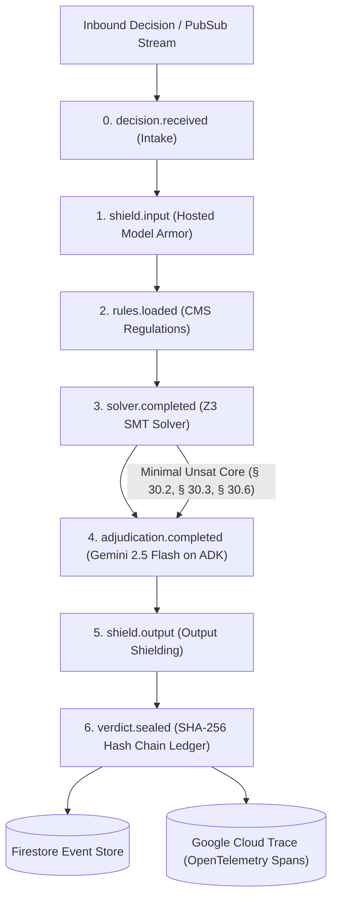

# Aegis — Master Hackathon Submission Video Guide (4:00 Final)

> **Devpost Hackathon Submission Artifact**  
> **Project:** Aegis — Institutional Fleet for Automated Decision Oversight  
> **Hackathon:** [All Things Agentic Hackathon](https://allthingsagentichackathon.devpost.com/)  
> **Primary Track:** Fortified Enterprise Fleet ($20,000)  
> **Live Deployment:** [https://aegis-708478134642.us-central1.run.app](https://aegis-708478134642.us-central1.run.app)  
> **Generated Video Master:** `aegis_hackathon_demo.mp4` (1080p Full HD, 30 FPS, 3m 55.6s, volume-normalized audio at -14 LUFS)

---

## 🎙️ Master Narration Script & 8-Segment Scene Breakdown (4:00 Target)

| Timestamp | Segment & Scene | Visual Content (Production Capture) | Narration Script (Flat, unhurried, ~150 wpm) |
| --- | --- | --- | --- |
| **0:00 – 0:35** | **1. Cold Open Slide** | "When AI Decision Engines Operate Without Oversight" — Cigna PxDx (300k denials at 1.2s each) & UnitedHealth nH Predict (cut off 91yo Gene Lokken). | Over two months in 2022, Cigna doctors denied more than three hundred thousand requests for payment. The average time spent on each was one point two seconds. The medical file was never opened. UnitedHealth's nH Predict cut off post-acute care for elderly patients and was reversed about ninety percent of the time on appeal — because only two patients in a thousand ever appeal. Gene Lokken was ninety-one. His therapy was stopped on day nineteen of a hundred-day benefit. His family paid a hundred and fifty thousand dollars. Aegis is the layer that should have been sitting in front of those systems. |
| **0:35 – 1:05** | **2. Core Design Axiom Slide** | "The One Design Decision That Matters" — **"The Solver holds the verdict. The model does not."** 3 Postures (`concur`, `escalate`, `dissent`). | One decision shapes everything else. The solver holds the verdict. The model does not. Gemini reviews every case against the same compiled constraints the Z3 solver sees, and writes the rationale a claimant will read. What it cannot do is clear a violation. Its verdict is measured against the binding solver result in three postures: it can concur, it can escalate for more scrutiny — and if it argues for a more permissive outcome than the constraints support, that dissent is recorded, and not honoured. Every outcome Aegis produces is reachable from the solver alone. *(Half-beat pause after "recorded, and not honoured")* |
| **1:05 – 1:40** | **3. Live App: Queue & Flagged Case** | Production App (`aegis-708478134642.us-central1.run.app`). Queue with 6 audited decisions, 3 flagged. `Fleet health 100% / All agents responding`, `Fleet online`, 7/7 green. | This is the live service. Six audited decisions, three flagged. Case 2048 is a denial of post-acute skilled nursing care. Aegis re-adjudicated it against the governing policy and found a contradiction: every governing requirement is satisfied on the documented facts, so the service is covered — and the source system denied it anyway. That is not a risk score. It is a proof that the denial cannot be reconciled with the rules it claims to apply. |
| **1:40 – 2:05** | **4. Live App: Upheld / Control Case** | Production App. Highlights control cases (Control Case A & B) showing green `UPHELD` badges. | This one matters more. A layer that flags every denial has told you nothing. These control cases are denials that are correct — the benefit period is exhausted, the care is custodial with no skilled component. Aegis upholds them. Three of six decisions here are flagged, not six. The oversight has to be able to say no. |
| **2:05 – 2:40** | **5. Live App: Inspector, Citations, Relaxation & Replay** | Opens Case 2048 decision inspector. Highlights findings with § 30.2, § 30.3, § 30.6 citations, minimal conflict set (Z3), plain-English relaxation, and clicks **"Fork and replay"** showing corrected outcome. | Every finding carries the clause it came from. Medical necessity, section 30.2. Skilled care, 30.3. The hundred-day benefit period, 30.6 — each traced to the statute and the regulation, not to an opinion. The minimal conflict set is the smallest group of clauses that cannot all hold at once. From it, Aegis proposes the smallest change that would resolve the contradiction, in plain English. And any decision can be forked and replayed — substitute the corrected finding, re-execute, and the claim is approved. |
| **2:40 – 3:10** | **6. Live App: Traces View & SHA-256 Ledger** | Navigates to **Traces View**: shows 7-hop span chain (`intake` → `input_shield` → `rules_ingestion` → `reconcile` → `readjudicator` → `output_shield` → `ledger`) with nested `generate_content gemini-2.5-flash` spans & SHA-256 hashes. | A decision takes seven hops. Intake, the input shield, rules ingestion, the solver, re-adjudication, the output shield, and the seal. Every hop opens an OpenTelemetry span exported to Google Cloud Trace, and every hop is written into an append-only ledger where each entry commits to its predecessor by SHA-256. The reasoning chain is not a log you have to trust. It is a chain you can verify. |
| **3:10 – 3:40** | **7. RESTORED Incident Benchmark Slide** | Benchmark slide (`slide4.html`): 52/52 cases verified live against Vertex AI, 85 ms deterministic core audit speed, 3/3 control cases. | The claim that Aegis would have caught these is checkable, so it is checked. Six recorded failures, reconstructed from the public record, each carrying its sources and the governing rule it contradicts. Fifty-two of fifty-two cases reach the recorded outcome, against live Gemini on Vertex, on every push. The deterministic core audits a claim in eighty-five milliseconds — against PxDx's one point two seconds — and reaches the same fifty-two verdicts as the full fleet. Removing the model changes nothing about who gets flagged. *(Half-beat pause after "Removing the model changes nothing about who gets flagged")* |
| **3:40 – 4:00** | **8. Stack & Close Slide** | Stack slide (`slide5.html`): ADK orchestration, Gemini on Vertex, hosted Model Armor, Z3 theorem prover, Firestore, Cloud Trace, Cloud Run. | ADK orchestration, Gemini on Vertex, hosted Model Armor, a Z3 theorem prover, Firestore, Cloud Trace, deployed on Cloud Run. If Aegis had been running, Gene Lokken's denial would have been caught on the day it was made. |

---

## 🏛️ System Architecture & Google Tech Stack

### Key Technical Attributes Pinned:
* **Production Status**: `Fleet health 100% / All agents responding`, `Fleet online`, 7/7 green.
* **Google ADK Runtime**: Real ADK `SequentialAgent` orchestrating 7 hops with `gemini-2.5-flash` on Vertex AI.
* **Google Cloud Model Armor**: Hosted input/output prompt injection, tool poisoning & PII screening.
* **Z3 Theorem Prover**: Calculates minimal unsat cores and legal relaxations (§ 30.2, § 30.3, § 30.6).
* **Cryptographic Event Ledger**: Append-only SHA-256 hash-chained event log supporting replay verification and timeline forking.
* **Google Cloud Trace**: OpenTelemetry spans exported directly to Cloud Trace with nested Gemini call telemetry.
